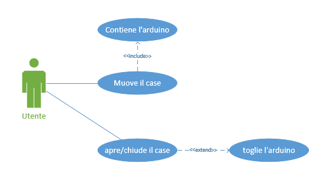
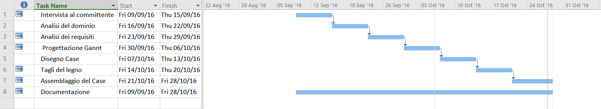

1. [Introduzione](#introduzione)

  - [Informazioni sul progetto](#informazioni-sul-progetto)

  - [Abstract](#abstract)

  - [Scopo](#scopo)

2. [Analisi](#analisi)

  - [Analisi del dominio](#analisi-del-dominio)

  - [Analisi e specifica dei requisiti](#analisi-e-specifica-dei-requisiti)

3. [Use case](#use-case)

  - [Pianificazione](#pianificazione)

  - [Analisi dei mezzi](#analisi-dei-mezzi)

4. [Progettazione](#progettazione)

  - [Design dell’architettura del sistema](#design-dell’architettura-del-sistema)

  - [Design dei dati e database](#design-dei-dati-e-database)

## Introduzione

### Informazioni sul progetto

- Scuola: SAMT - Scuola Arti e Mestieri Trevano
- Sezione: Informatica
- Matera: Progetti
- Titolo del progetto: Arduino Case
- Docenti responsabili: Luca Muggiasca & Adriano Barchi
- Classe: I3AC
- Anno scolastico: 2016/2017
- Data di inizio: 09.09.2016
- Data di consegna: 28.10.2016

### Abstract
  > *The Arduino is an useful tools with which you can do many things, the only problem is that in certain situations is fragile, what better than this Case protect it from shocks?*

### Scopo
Lo scopo principale del progetto è quello di far capire all'alunno come si redige una documentazione, come si progetta e si crea un nuovo progetto.  
Inoltre il progetto si basa sulla progettazione e realizzazione di un case per l'arduino, in modo da renderlo più sicuro quando viene spostato

## Analisi

### Analisi del dominio

Il case serve per proteggere l'Arduino quando viene spostato o trasportato in giro, il case è stato ideato in modo che se l'arduino si guasta è possibile togliere il coperchio ed estrarre l'Arduino facilmente senza dover svitare nessuna vite, per utilizzare questo prodotto non bisogna avere competenze particolari  

### Analisi e specifica dei requisiti

|ID |REQ-001                                       |
|---|------------------------------------------------|
|**Nome**    |Struttura case |
|**Priorità**|1                     |
|**Versione**|1.0                   |
|            |**Sotto requisiti** |
|**001**      |Deve essere in compensato|
|**002**      |Deve resistere se cade da 1m di altezza|
|**003**      |Deve esser possibile capovolgere il case senza far aprire il coperchio|
|**005**      |Deve contenere un Arduino Uno|
|**005**      |I pin devono essere accessibili anche con il case chiuso|
|**006**      |Il tasto reset dell'arduino accessibile senza aprire il case|
|**007**      |Devono essere presenti dei fori di areazione|
|**008**      |L'Arduino deve restare fissato al case|

### Use case

### Pianificazione

### Analisi dei mezzi

Software per la realizzazione:

- Google SketchUp v.16.1.1449, utilizzato per creare la progettazione 3D dal case

- Atom v1.11.2, utilizzato per creare la documentazione e i vari diari

Hardware:

- Attrezzi di falegnameria, per il taglio del legno

- Arduino Uno, per eserguire le misure ed i test

## Progettazione
### Prodotto finale

### Materiale
**Compensato**: 200 cm x 200cm x 4 mm, il materiale del case  
**Colla per legno**, utilizzata per mettere insieme le varie parti  
**Velcro**: 5cm2, utilizzato per permettere l'apertura e la chiusura del coperchio del case  
**Arduino Uno**, utilizzato per testare la grandezza del case  
**Plrolunghe per pin**, utilizzate per permettere la fuoriuscita dei pin

### Costi vari
| |Costo singolo|Costo totale|
|---|------------------------------------------------|
|**Compensato**|18 Fr m2|0,36 Fr|
|**Colla per legno**|5 Fr|5 Fr|
|**Velcro**|4 Fr| 4 Fr |
|**Manodopera**| 45 Fr/h| 23 ore di lavoro, 1035 Fr
Costo totale di 1044,36 Fr
